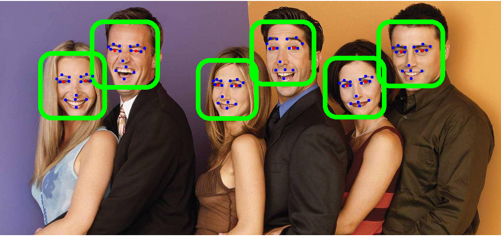
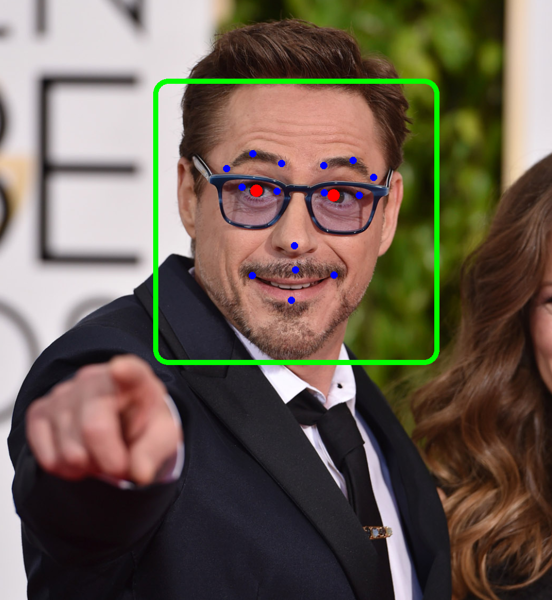

[![Forks][forks-shield]][forks-url] [![Stargazers][stars-shield]][stars-url] [![Issues][issues-shield]][issues-url] [![MIT License][license-shield]][license-url] [![LinkedIn][linkedin-shield]][linkedin-url]

 

  
  <h1 align="center">Pidroid</h1>

<!-- TABLE OF CONTENTS -->
## Table of Contents

* [About the Project](#about-the-project)
  * [Motivation](#motivation)
  * [Built With](#built-with)
  * [Roadmap](#roadmap)

## About the Project

	

Pidroid is android library to perform fast face detection, pupil detection and landmarks detection without third-party dependencies dependencies.

### Motivation

This library has been developed to facilitate the integration of a face detection method in your Android application.

Usually, to install a face detection library, some integration with third-party software such as OpenCV or Tensorflow Lite or registration on a platform such as Firebase is necessary.

On the other hand, the weight of face detection models is usually high, which causes the application to grow unnecessarily.

Pidroid provides a completely dependency-free alternative to make it easier for developers to use these libraries.

### Built With

This library currently is full developed in Kotlin with C++, no additional dependencies or installation is needed :) 

- Face detection feature is based on ***Pixel Intensity Comparison-based Object detection*** paper (https://arxiv.org/pdf/1305.4537.pdf)
- Pupil detection feature is based on [Eye pupil localization with an ensemble of randomized trees](https://www.sciencedirect.com/science/article/abs/pii/S0031320313003294)
- Landmarks detection feature is based on [Fast Localization of Facial Landmark Points](https://arxiv.org/pdf/1403.6888.pdf)

	

### Roadmap

- [x] High speed processing
- [x] Does not require additional dependencies
- [x] There is no need for image preprocessing prior detection
- [x] Face detection
- [x] Pupil detection
- [x] Landmarks detection
- [ ] Publish Library as Github Package
- [ ] Pure Java Pidroid (to delete avoid Kotlin dependency)
- [ ] Rotated faces detection
- [ ] Neon support
- [ ] SSE support
- [ ] Tegra support

README in construction... ;)

[forks-shield]: https://img.shields.io/github/forks/Suaro/pidroid.svg?style=for-the-badge
[forks-url]: https://github.com/Suaro/pidroid/network/members
[stars-shield]: https://img.shields.io/github/stars/Suaro/pidroid.svg?style=for-the-badge
[stars-url]: https://github.com/Suaro/pidroid/stargazers
[issues-shield]: https://img.shields.io/github/issues/Suaro/pidroid.svg?style=for-the-badge
[issues-url]: https://github.com/Suaro/pidroid/issues
[license-shield]: https://img.shields.io/github/license/Suaro/pidroid.svg?style=for-the-badge
[license-url]: https://github.com/Suaro/pidroid/blob/master/LICENSE
[linkedin-shield]: https://img.shields.io/badge/-LinkedIn-black.svg?style=for-the-badge&logo=linkedin&colorB=555
[linkedin-url]: https://linkedin.com/in/adriansp3

