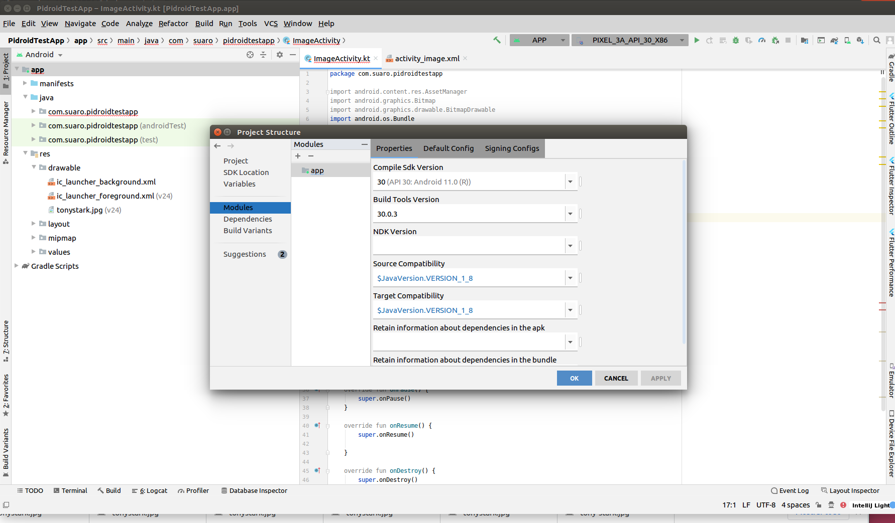
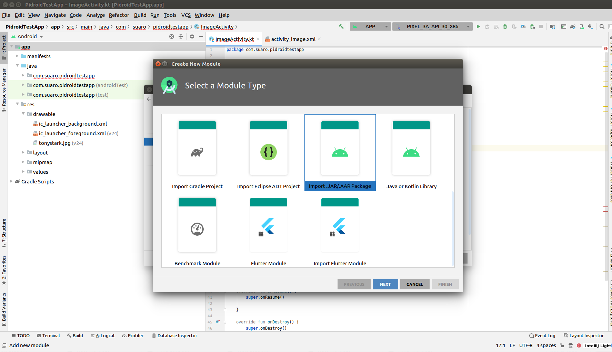
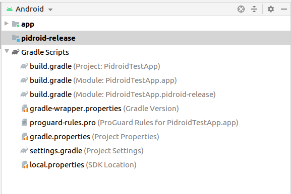
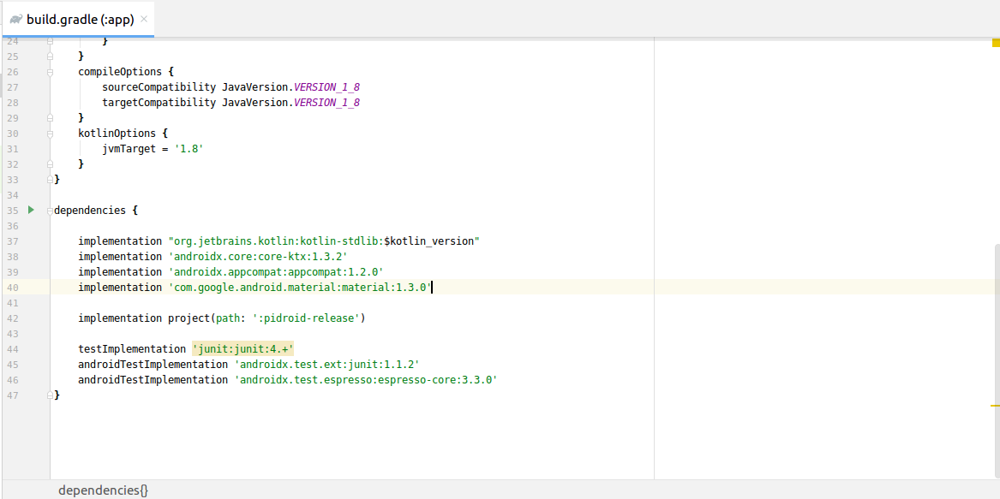

<p align="center">
  <a href="https://github.com/Suaro/pidroid">
    
  </a>
  <h1 align="center">Pidroid</h1>
</p>

<br/>

[![Forks][forks-shield]][forks-url] [![Stargazers][stars-shield]][stars-url] [![Issues][issues-shield]][issues-url] [![MIT License][license-shield]][license-url] [![LinkedIn][linkedin-shield]][linkedin-url]

<!-- TABLE OF CONTENTS -->
## Table of Contents

* [About the Project](#about-the-project)
  * [Motivation](#motivation)
  * [Built With](#built-with)
  * [Roadmap](#roadmap)
* [Implementation](#usage)
  * [Local implementation](#local-implementation)
  * [Gradle implementation](#gradle-implementation)
* [Usage](#usage)
  * [Basic Usage](#basic-usage)
  * [Parameters](#parameters)
  * [Examples](#examples)
  	* [Image demo](#image-demo)
  	* [Real time demo](#real-time-demo) 

## About the Project
<div align="center">
	
</div>

Pidroid is android library to perform fast face detection, pupil detection and landmarks detection without third-party dependencies dependencies.

### Motivation

This library has been developed to facilitate the integration of a face detection method in your Android application.

Usually, to install a face detection library, some integration with third-party software such as OpenCV or Tensorflow Lite or registration on a platform such as Firebase is necessary.

On the other hand, the weight of face detection models is usually high, which causes the application to grow unnecessarily.

Pidroid provides a completely dependency-free alternative to make it easier for developers to use these libraries.

### Built With

This library currently is full developed in Kotlin with C++, no additional dependencies or installation is needed :) 

- Face detection feature is based on ***Pixel Intensity Comparison-based Object detection*** paper (https://arxiv.org/pdf/1305.4537.pdf)
- Pupil detection feature is based on [Eye pupil localization with an ensemble of randomized trees](https://www.sciencedirect.com/science/article/abs/pii/S0031320313003294)
- Landmarks detection feature is based on [Fast Localization of Facial Landmark Points](https://arxiv.org/pdf/1403.6888.pdf)


<div align="center">
	
</div>

### Roadmap

- [x] High speed processing
- [x] Does not require additional dependencies
- [x] There is no need for image preprocessing prior detection
- [x] Face detection
- [x] Pupil detection
- [x] Landmarks detection
- [x] Pure Java Pidroid (to delete avoid Kotlin dependency)
- [ ] Publish Library as Github Package
- [ ] Rotated faces detection
- [ ] Neon support
- [ ] SSE support


## Usage


### Local implementation

First, right click on your app module and click on __Open Module Settings__.
<div align="center">
	
</div>

Now, click on + button above app module. The following window will open:

<div align="center">
	
</div>

Then click on Import .JAR/.AAR Package and select pidroid-release.aar module. Your project look like this:

<div align="center">
	
</div>

Finally, add the following line to your build.gradle of the app module:

```xml
implementation project(path: ':pidroid-release')
```

Your app's build.gradle look like this:

<div align="center">
	
</div>


### Gradle implementation

Still in progress..


## Usage

### Basic usage

Pidroid library provides singleton object called "Pidroid". First, you need setup library in your Activity onCreate.

```kotlin
override fun onCreate(savedInstanceState: Bundle?) {
        super.onCreate(savedInstanceState)
        setContentView(...)

		// Do some stuff...

        val pidroidConfig = PidroidConfig()
        Pidroid.setup(this, pidroidConfig)
    }
```

After setup finish, you can call detectFace function like this (example with Bitmap):

```kotlin
fun callDetectFace(bitmap: Bitmap): FaceDetectionResult {
        val pixels = IntArray(bitmap.width * bitmap.height * 4)
        bitmap.getPixels(pixels, 0, bitmap.width, 0, 0, bitmap.width, bitmap.height)
        var dInfo = FaceDetectionResult()
        Pidroid.detectFace(pixels, bitmap.width, bitmap.height, dInfo)
        return dInfo
    }

```

### Parameters

All configuration parameters are in PidroidConfig class.

| Parameter name                    | Description                                                                                                                                                                        | Default value                                           |
|------------------------------|------------------------------------------------------------------------------------------------------------------------------------------------------------------------------------|------------------------------------------------------|
| minsize          | Min radius of faces detected                                                                        | 150                                                    |
| maxsize          | Max radius of faces detected                                                                        | 1000                                                    |
| prominentFaceOnly          | Parameter that determines if you want to return only the most predominant face                                                                        | False                              |
| clustering          | This parameter groups detections to prevent a face from being detected multiple times                                                                      | True                              |
| stridefactorWidth          | This parameter determines how many pixels the sliding window is moved to detect. For example, if the value is 0.1 and the image is 1000 pixels wide, the sliding window will move every 100 pixels.                                                                      | 0.1                              |
| stridefactorHeight          | Same as stridefactorWidth but for height                                                              | 0.1                              |
| scalefactor          | The PICO algorithm searches for different face sizes starting from minsize to maxsize. This parameter determines how much the search size increases each iteration.                                                                      | 1.1                        |
| qthreshold          | Minimum threshold to consider a region as a face.   | 3.0                        |
| perturbs          | The detection of pupils and landmarks, start from an initial region to predict the exact position. This initial region is disturbed N times to increase the precision of detection. This also makes the method slower the larger this parameter grows.   | 10                      |
| pupilDetectionEnable          | This parameter enable pupil detection  | True                      |
| landmarkDetectionEnable          | This parameter enable landmark detection. Its mandatory pupilDetectionEnable to True to detect landmarks. | True                      |

### Examples

In this project you will find two sample applications. The first is a simple application that performs the prediction on a bitmap and draws the result.

The second opens the camera and performs face, pupil and landmark detection in real time using a separate Thread so as not to block the UI.

#### Image demo

Still in progress..

#### Real Time demo

<div align="center">
	
</div>

Still in progress..

## Author

* Adrián Suárez Parra (https://linkedin.com/in/adriansp3)

## License
Copyright © 2021 Adrián Suárez Parra (Suaro)

This software is distributed under the MIT license. See the [LICENSE](https://github.com/Suaro/pidroid/blob/master/LICENSE) file for the full license text.

[forks-shield]: https://img.shields.io/github/forks/Suaro/pidroid.svg?style=for-the-badge
[forks-url]: https://github.com/Suaro/pidroid/network/members
[stars-shield]: https://img.shields.io/github/stars/Suaro/pidroid.svg?style=for-the-badge
[stars-url]: https://github.com/Suaro/pidroid/stargazers
[issues-shield]: https://img.shields.io/github/issues/Suaro/pidroid.svg?style=for-the-badge
[issues-url]: https://github.com/Suaro/pidroid/issues
[license-shield]: https://img.shields.io/github/license/Suaro/pidroid.svg?style=for-the-badge
[license-url]: https://github.com/Suaro/pidroid/blob/master/LICENSE
[linkedin-shield]: https://img.shields.io/badge/-LinkedIn-black.svg?style=for-the-badge&logo=linkedin&colorB=555
[linkedin-url]: https://linkedin.com/in/adriansp3